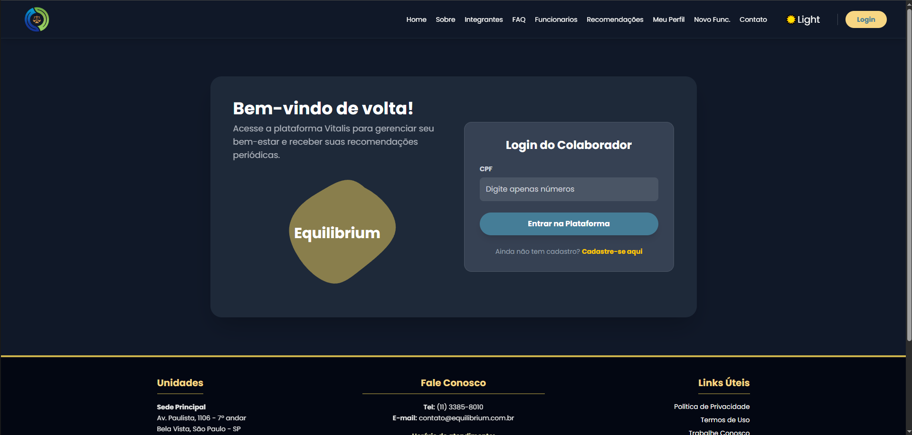
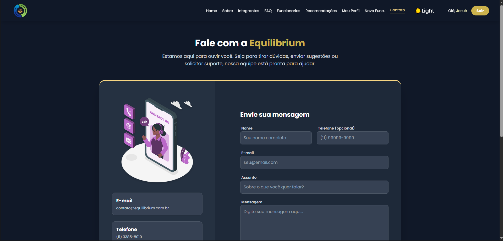
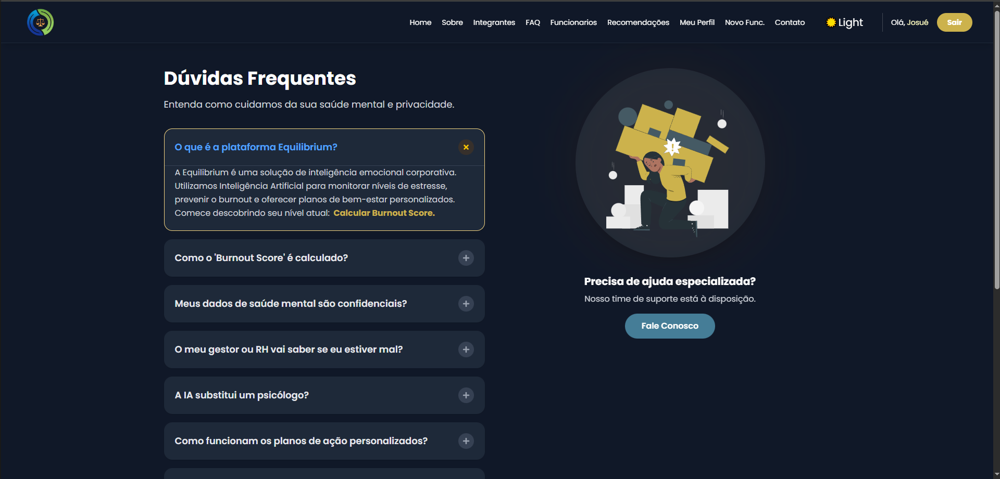
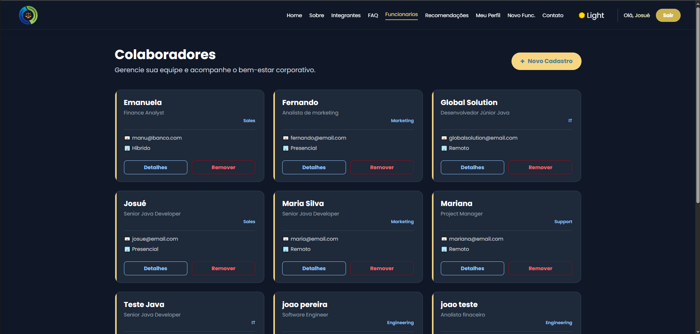
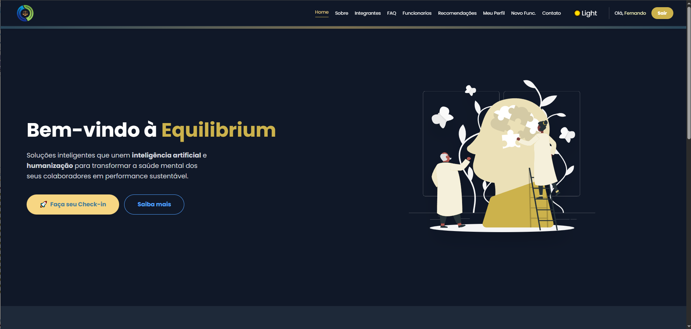
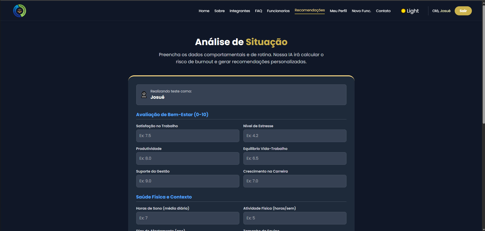
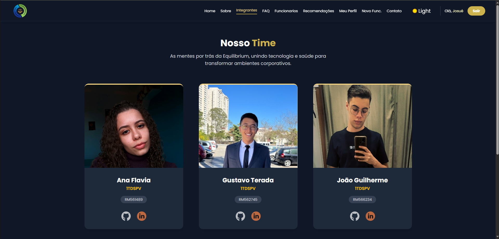
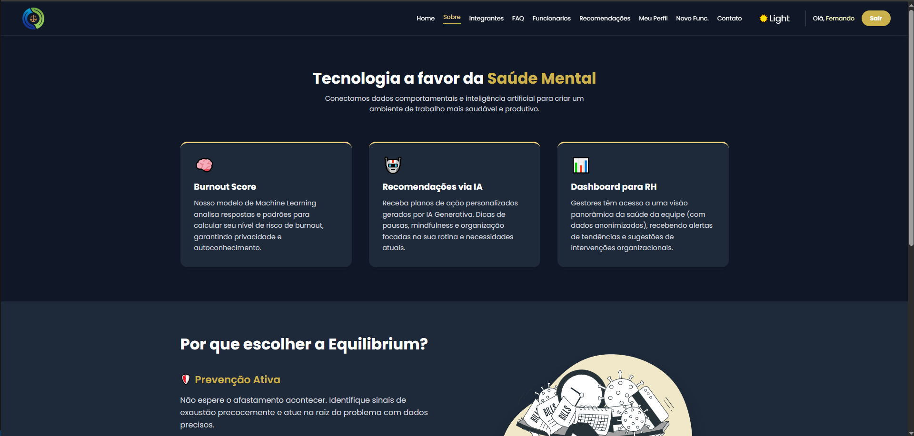

# 🧠 Equilibrium - Inteligência Emocional Corporativa

> **Status do Projeto:** 🚀 Deployado na nuvem

* **Link do deploy do frontend:** [https://equilibrium-906663117168.us-central1.run.app/](https://equilibrium-906663117168.us-central1.run.app/)
* **Link do deploy do backend:** [https://equilibrium-backend-906663117168.us-central1.run.app](https://equilibrium-backend-906663117168.us-central1.run.app)

## 📋 Sumário

1. [Sobre o Projeto](#-sobre-o-projeto)
2. [Tecnologias Utilizadas](#-tecnologias-utilizadas)
3. [Funcionalidades Principais](#-funcionalidades-principais)
4. [Estrutura de Pastas](#-estrutura-de-pastas)
5. [Endpoints e Integração](#-endpoints-e-integração)
6. [Como Usar](#-como-usar)
7. [Instalação e Execução Local](#-instalação-e-execução-local)
8. [Autores e Créditos](#-autores-e-créditos)
9. [Links Importantes](#-links-importantes)

---

## 📖 Sobre o Projeto

O **Equilibrium** nasce como uma resposta inovadora e estratégica às crescentes demandas dos departamentos de Recursos Humanos por soluções que promovam o bem-estar e a saúde mental dos colaboradores no ambiente corporativo.

Em um cenário onde o *burnout* impacta diretamente a produtividade, nossa plataforma utiliza um avançado modelo de **Inteligência Artificial** (Regressão e Generativa) para analisar de forma contínua o estado mental dos funcionários. Por meio de check-ins periódicos, calculamos o risco individual e entregamos recomendações personalizadas e práticas, orientando tanto o colaborador quanto o RH sobre as melhores ações para promover o equilíbrio emocional.

O sistema integra tecnologia de ponta, ciência de dados e práticas de gestão humanizada, alinhando-se aos Objetivos de Desenvolvimento Sustentável (ODS 8 - Trabalho Decente e Crescimento Econômico).

---

## 🛠 Tecnologias Utilizadas

O projeto foi desenvolvido com uma arquitetura moderna e escalável:

**Front-end:**
*  **ReactJS** (Vite)
*  **TypeScript**
*  **Tailwind CSS** (Estilização e Dark Mode)
* **Zod** (Validação de Schemas)
* **React Hook Form** (Gerenciamento de formulários)

**Back-end & Dados:**
*  **Java** com Framework **Quarkus**
*  **Oracle Database** (Modelagem SQL Developer)
* **Python** (API de Machine Learning para cálculo de Burnout)
* **Google Generative AI** (Geração de recomendações textuais)

**Infraestrutura:**
* **Google Cloud Run** (Hospedagem e Deploy)

---

## ✨ Funcionalidades Principais

1.  **Login Seguro:** Acesso via CPF para colaboradores e gestores.
2.  **Dashboard Personalizado:** Visão geral do último *Burnout Score* e recomendações ativas.
3.  **Check-in de Situação:** Formulário dinâmico para coleta de dados comportamentais, de sono e rotina de trabalho.
4.  **Cálculo de Burnout (IA):** Análise em tempo real do risco de esgotamento profissional.
5.  **Recomendações Inteligentes:** Sugestões geradas por IA para melhoria da qualidade de vida (ex: pausas, terapia, organização).
6.  **Gestão de Colaboradores (RH):** Cadastro, listagem e remoção de funcionários.
7.  **Modo Escuro/Claro:** Interface adaptável para conforto visual.

---

## 📂 Estrutura de Pastas

A estrutura do projeto Front-end segue o padrão React/Vite:

```
GLOBAL-SOLUTION-2-SEM-FRONTEND/
├── node_modules/
├── public/
├── src/
│   ├── api/             # Configurações de chamadas HTTP (Axios/Fetch)
│   ├── assets/          # Imagens, vetores e ícones
│   ├── components/      # Componentes reutilizáveis (Header, Footer, Forms, Cards)
│   ├── context/         # Context API (Auth, Theme, Funcionario)
│   ├── pages/           # Páginas da aplicação (Rotas)
│   ├── schemas/         # Validações Zod (Login, Cadastro)
│   ├── types/           # Definições de Tipos TypeScript (Interfaces)
│   ├── App.tsx          # Componente Raiz e Rotas
│   ├── index.css        # Estilos globais e configuração Tailwind
│   ├── main.tsx         # Ponto de entrada
│   └── vite-env.d.ts
├── .env                 # Variáveis de ambiente
├── index.html
├── package.json
├── tailwind.config.js   # (configuração via CSS no v4)
└── vite.config.ts
```

---

## 🔗 Endpoints e Integração

O Front-end se comunica com a API Java através das seguintes rotas principais:

| Verbo HTTP | URI | Descrição | Resposta (Sucesso) | Resposta (Erro) |
| :--- | :--- | :--- | :--- | :--- |
| **POST** | `/login` | Autentica funcionário (login por CPF). Retorna os detalhes do usuário se bem-sucedido. | 200 OK (Detalhes do Funcionário) | 401 Unauthorized (CPF inválido) / 500 Internal Error |
| **GET** | `/departamentos` | Lista todos os departamentos cadastrados para preencher dropdowns. | 200 OK (Lista de Departamentos) | 500 Internal Error |
| **POST** | `/funcionarios` | Cadastra um novo funcionário e seus dados de contato. | 201 Created (Detalhes Completos) | 400 Bad Request / 500 Internal Error |
| **GET** | `/funcionarios` | Lista todos os funcionários cadastrados. | 200 OK (Lista de Funcionários) | 500 Internal Error |
| **GET** | `/funcionarios/{id}` | Busca os detalhes de um funcionário específico por ID. | 200 OK (Detalhes do Funcionário) | 404 Not Found / 500 Internal Error |
| **PUT** | `/funcionarios/{id}` | Atualiza os dados cadastrais e contratuais de um funcionário. | 200 OK (Detalhes Atualizados) | 400 Bad Request / 500 Internal Error |
| **DELETE** | `/funcionarios/{id}` | Remove um funcionário e seus dados associados do sistema. | 204 No Content | 404 Not Found / 500 Internal Error |
| **GET** | `/funcionarios/{id}/testes-situacao` | Lista o histórico de testes de situação (check-ins) realizados por um funcionário. | 200 OK (Lista de Testes) | 404 Not Found (Funcionário não existe) / 500 Internal Error |
| **GET** | `/funcionarios/{id}/recomendacao-atual` | Busca a última recomendação gerada pela IA para o funcionário. | 200 OK (Detalhes da Recomendação) | 204 No Content (Sem recomendações) / 404 Not Found / 500 Internal Error |
| **POST** | `/testes-situacao` | Registra um novo teste de situação (check-in). Aciona a IA para cálculo de Burnout e geração de recomendações. | 201 Created (Detalhes do Teste com Score atualizado) | 400 Bad Request / 500 Internal Error |
| **GET** | `/testes-situacao/{id}` | Busca um teste de situação específico pelo ID do teste. | 200 OK (Detalhes do Teste) | 404 Not Found / 500 Internal Error |
| **GET** | `/testes-situacao/funcionario/{idFunc}` | Lista testes filtrando pelo ID do funcionário (Endpoint alternativo). | 200 OK (Lista de Testes) | 500 Internal Error |
| **DELETE** | `/testes-situacao/{id}` | Remove um registro de teste de situação. | 204 No Content | 404 Not Found / 500 Internal Error |

---

## 🚀 Como Usar

Como a aplicação está deployada na nuvem, basta acessar essa URL:

* **Link do deploy:** [https://equilibrium-906663117168.us-central1.run.app/](https://equilibrium-906663117168.us-central1.run.app/)

1.  **Login:** Acesse a plataforma e entre com seu CPF cadastrado.
2.  **Novo funcionario:** Clique em "Novo Func." para cadastrar um novo funcionário.
3.  **Meu Perfil:** Clique em meu Perfil para visualizar seus dados, assim como as recomendações pra sua saúde mental e seu burnoutScore.
4.  **Recomendações** Clique em "Recomendações" para responder ao questionário e obter suas recomendações e burnoutScore.
5.  **Área do RH:** Utilize o menu "Funcionários" para gerenciar a equipe e obter insights.
6.  **Tema:** Utilize o ícone de Lua/Sol no menu para alternar entre modo escuro e claro.

### 📸 Demonstração

| Tela de Login | Dashboard |
| :---: | :---: |
|  |  |

| Contato | FAQ |
| :---: | :---: |
|  |  |

| Funcioarios | HomePage |
| :---: | :---: |
|  |  |

| Análise de Situação | Cadastro de Funcionário |
| :---: | :---: |
|  |  |

| Integrates | Sobre |
| :---: | :---: |
|  |  |


---

## 💻 Instalação e Execução Local

Caso queira rodar o projeto localmente em sua máquina:

**Pré-requisitos:** Node.js (v18+) e NPM/Yarn.

1.  **Clone o repositório:**
    ```bash
    git clone [https://github.com/vitalis-sa/GLOBAL-SOLUTION-2-SEM-FRONTEND.git](https://github.com/vitalis-sa/GLOBAL-SOLUTION-2-SEM-FRONTEND.git)
    ```
2.  **Acesse a pasta:**
    ```bash
    cd GLOBAL-SOLUTION-2-SEM-FRONTEND
    ```
3.  **Instale as dependências:**
    ```bash
    npm install
    ```
4.  **Rode o projeto:**
    ```bash
    npm run dev
    ```
5.  Acesse `http://localhost:5173` no navegador.

---

## 👥 Autores e Créditos

Este projeto foi desenvolvido pela equipe **Vitalis** para a Global Solution (2º Semestre - FIAP).

| Nome | RM | Turma | Links |
| :--- | :--- | :--- | :--- |
| **Ana Flavia Camelo** | RM561489 | 1TDSPV | [GitHub](https://www.github.com/afcamelo) \| [LinkedIn](https://www.linkedin.com/in/anaflaviacamelo/) |
| **Gustavo Kenji Terada** | RM562745 | 1TDSPV | [GitHub](https://www.github.com/gkenji110) \| [LinkedIn](https://www.linkedin.com/in/gustavo-terada-604661301/) |
| **João Guilherme Carvalho** | RM566234 | 1TDSPV | [GitHub](https://www.github.com/JoaoGuiNovaes) \| [LinkedIn](https://www.linkedin.com/in/jo%C3%A3o-guilherme-carvalho-novaes/) |

---

## 🔗 Links Importantes

* **Repositório GitHub:** [https://github.com/vitalis-sa/GLOBAL-SOLUTION-2-SEM-FRONTEND/](https://github.com/vitalis-sa/GLOBAL-SOLUTION-2-SEM-FRONTEND/)
* **Vídeo Demonstração:** [https://youtu.be/aNyjvwKZp7M](https://youtu.be/aNyjvwKZp7M)
* **Link do deploy do frontend:** [https://equilibrium-906663117168.us-central1.run.app/](https://equilibrium-906663117168.us-central1.run.app/)
* **Link do deploy do backend:** [https://equilibrium-backend-906663117168.us-central1.run.app](https://equilibrium-backend-906663117168.us-central1.run.app)

---
&copy; 2024 Equilibrium. Todos os direitos reservados.